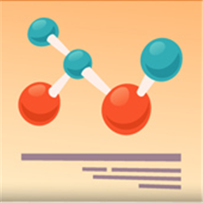

## Game Edukasi Science Mission
Belajar tentang perubahan wujud benda dengan cara yang menyenangkan.
Coba sekarang di<a href="https://ongoingdev.github.io/science-mission/" target="_blank">https://ongoingdev.github.io/science-mission/</a>

- 👋 Hi, I’m @ongoingdev
- 👀 I’m interested in ...
- 🌱 I’m currently learning ...
- 💞️ I’m looking to collaborate on ...
- 📫 How to reach me ...

<!---
ongoingdev is a ✨ special ✨ repository because its `README.md` (this file) appears on your GitHub profile.
You can click the Preview link to take a look at your changes.
--->